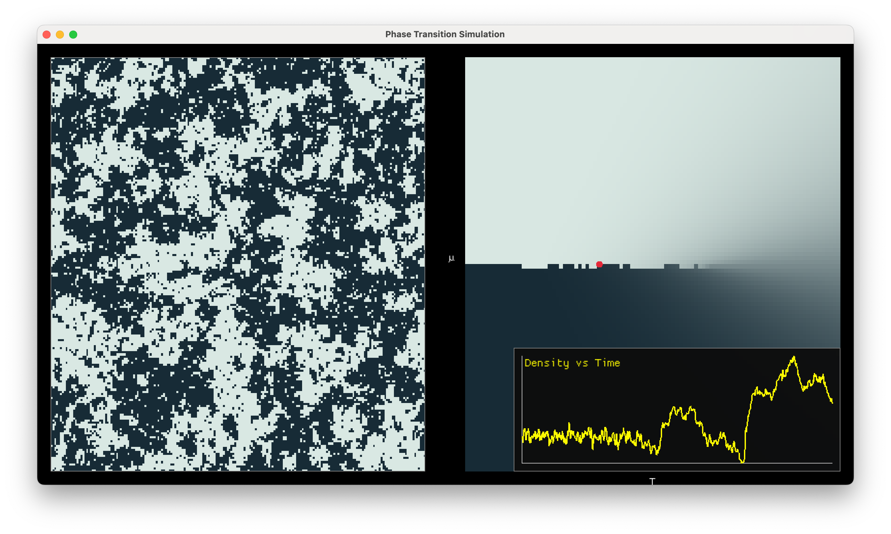

# Phase Simulation (Rust + Macroquad)

A fast, interactive 2D lattice phase-transition simulator written in Rust. It visualizes a simple lattice gas/Ising-like model with controls for temperature and chemical potential, and renders an equilibrium phase diagram.

- Interactive UI with real-time simulation
- Phase diagram and mean-field free-energy plot
- CSV export of time series and lattice snapshots
- GPU-friendly rendering via `macroquad`



## Getting Started

### Prerequisites
- Rust (stable). Install via `rustup`.
- macOS/Linux/Windows supported.

### Build and Run (GUI)

```bash
# Run the interactive app
cargo run
```

Controls:
- Arrow keys: change `T` (Up/Down) and `µ` (Left/Right)
- Space: randomize lattice
- M: cycle panel (UI → Phase diagram → Free-energy plot)
- D: toggle density popup
- S: save CSV snapshot to working directory

### Export CSV

Press `S` while the app is running to save a CSV snapshot of the time series in the current working directory.

## Repository Layout

- `src/main.rs`: interactive GUI app (Macroquad)
- `src/density_plot.rs`: lightweight time-series popup
 

## How It Works

- Lattice gas with nearest-neighbor interaction `J`
- Glauber dynamics Monte Carlo updates
- Mean-field functional:

  $$
  f_{tc}(\rho) = \frac{2J\rho^2 + \mu\rho}{T} - \left[ \rho\ln\rho + (1-\rho)\ln(1-\rho) \right]
  $$

## Data Export

Time-series CSV schema:
```
step,temperature,chem_potential,density
```
Snapshots are matrices of `0/1` (empty/molecule).

## License

MIT.