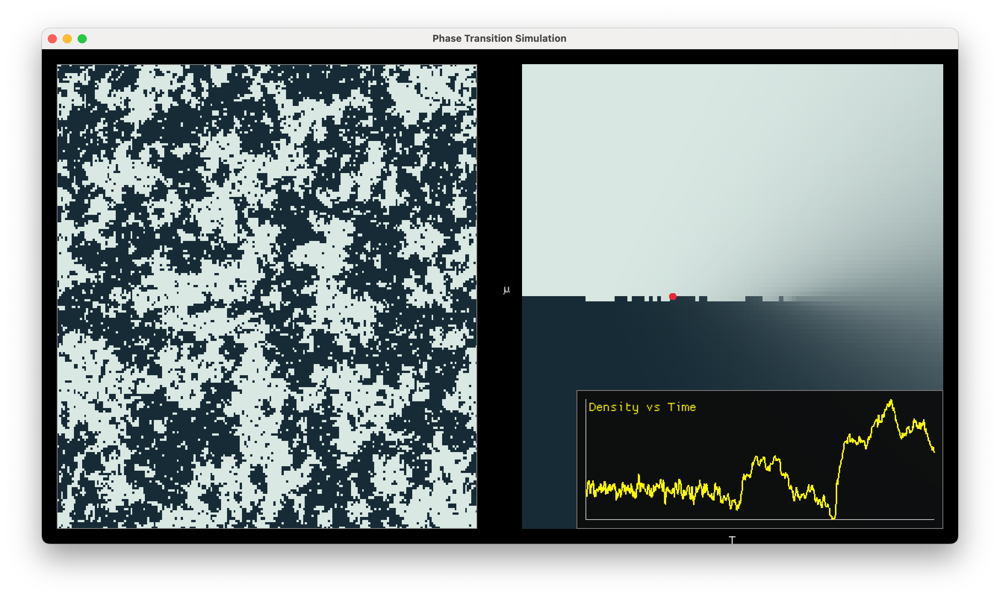

# Lattice Simulator (Rust + Macroquad)

An interactive 2D lattice-gas / Ising phase-transition simulator written in Rust for the paper [*Statistical mechanics for organic mixed conductors: phase transitions in a lattice gas*](https://arxiv.org/abs/2512.20727).

- Interactive UI with real-time simulation
- Phase diagram and mean-field free-energy plot
- CSV export of time series and lattice snapshots
- GPU-friendly rendering via `macroquad`



## Getting Started

### Web Version (No Installation Required)

The simulation is available as a WebAssembly app. See the `web-deploy/` directory for deployment-ready files.

**Local testing:**
```bash
cd web-deploy
python3 -m http.server 8000
# Open http://localhost:8000
```

### Desktop Version

**Prerequisites:**
- Rust (stable). Install via `rustup`.
- macOS/Linux/Windows supported.

**Build and run:**
```bash
cargo run
```

**Build for web:**
```bash
cargo build --release --target wasm32-unknown-unknown
cp target/wasm32-unknown-unknown/release/lattice_simulator.wasm web-deploy/
```

## Repository Layout

- `src/main.rs` - Interactive GUI app (Macroquad)
- `src/density_plot.rs` - Lightweight time-series popup
- `web-deploy/` - Production-ready web deployment files
- `.cargo/config.toml` - WASM build configuration

## Model

## Model

Lattice gas on a periodic 2D square lattice with nearest-neighbor coupling $J$ and chemical potential $\mu$, evolved by Metropolis Monte Carlo. The mean-field reduced free-energy density is

$$
f_{tc}(\rho) = \frac{2J\rho^2 + \mu\rho}{T} - \bigl[\rho\ln\rho + (1-\rho)\ln(1-\rho)\bigr].
$$

## Data Export

Time-series CSV schema:
```
step,temperature,chem_potential,density
```
Snapshots are matrices of `0/1` (empty/molecule).

## License

MIT.