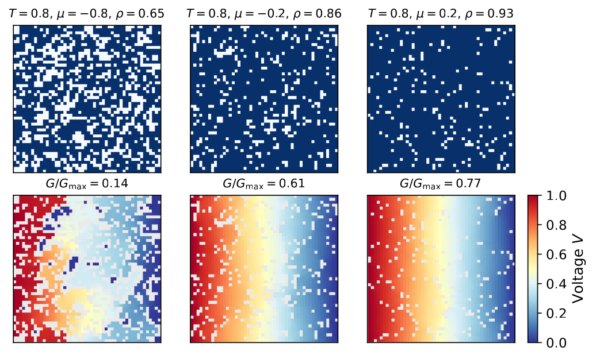

# Lattice Simulator (Rust + Macroquad)

An interactive 2D lattice-gas / Ising phase-transition simulator written in Rust for the paper [*Statistical mechanics for organic mixed conductors: phase transitions in a lattice gas*](https://arxiv.org/abs/2512.20727).

Launch in the browser [here](https://lukasbongartz.github.io/rust-lattice-simulator/web-deploy/) from the `web-deployment` branch.


## Prerequisites

- Rust (stable) via [`rustup`](https://rustup.rs/).
- For the notebook: Python 3.9+ with `numpy`, `scipy`, `numba`, `matplotlib`, `tqdm`, `jupyter`.

## Interactive GUI

```bash
cargo run --release
```

Controls:

| Key | Action |
| --- | --- |
| `↑` / `↓` | Increase / decrease temperature `T` |
| `←` / `→` | Decrease / increase chemical potential `µ` |
| `Space` | Randomize the lattice |
| `M` | Cycle panel: UI → phase diagram → free-energy plot |
| `D` | Toggle density-vs-time popup |
| `S` | Save time-series CSV to the working directory |

## Headless CLI

```bash
cargo build --release
./target/release/ps_cli --help

./target/release/ps_cli \
    --width 50 --height 50 --steps 15000 \
    --temperature 0.8 --chem-potential=-0.5 --interaction=0.5 \
    --output run.csv --snapshot-csv snap.csv
```

The CLI writes two artifacts:

- **Time-series CSV** (`--output`) with the schema `step,temperature,chem_potential,density`.
- **Snapshot CSV** (`--snapshot-csv`, optional) — a `0/1` matrix of the final lattice configuration.

## Notebook

For each point on a $(T, \mu)$ grid, the notebook drives the CLI to generate an equilibrium Monte Carlo lattice and solves Kirchhoff's equations across the lattice ($V = 1$ on the left edge, $V = 0$ on the right). The result is the effective conductance $G/G_\mathrm{max}$ as a function of carrier density $\rho$, illustrating the percolation-driven transition near the phase boundary.

The notebook auto-builds the CLI on first run and writes figures to `figures/` and intermediate CSVs to `data/`.



## Model

Lattice gas on a periodic 2D square lattice with nearest-neighbor coupling $J$ and chemical potential $\mu$, evolved by Metropolis Monte Carlo. The mean-field reduced free-energy density is

$$
f_{tc}(\rho) = \frac{2J\rho^2 + \mu\rho}{T} - \bigl[\rho\ln\rho + (1-\rho)\ln(1-\rho)\bigr].
$$

## License

MIT.
